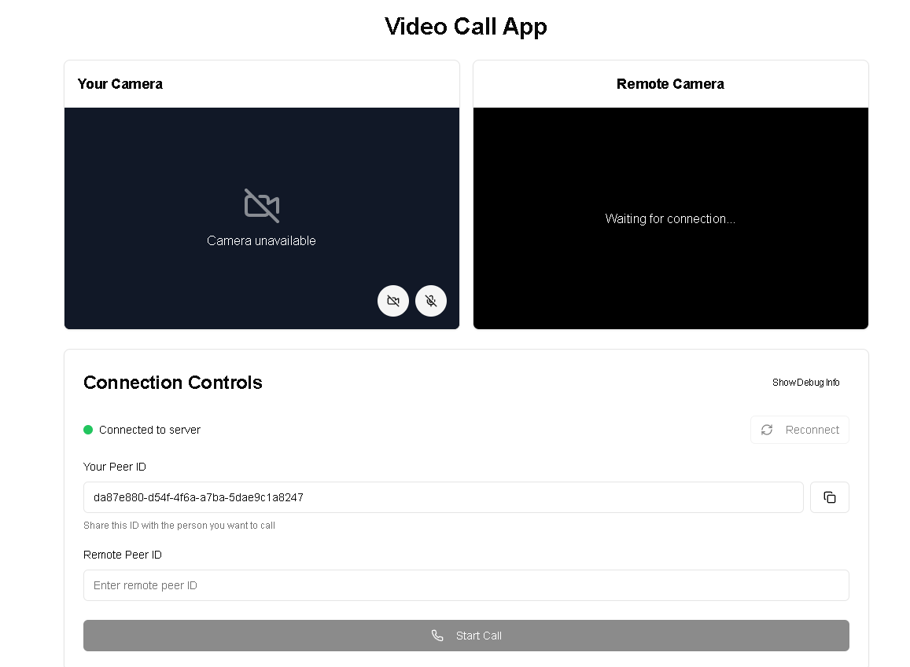

# 📹 VideoCall App – QuickMeet

A high-quality, real-time video calling web application built using **Next.js**, **Tailwind CSS**, **TypeScript**, and **PeerJS** (WebRTC). This project replicates core features of Google Meet such as peer-to-peer video calls, responsive UI, and secure room-based connections.

## 🔗 Live Privew

https://quick-meet-rose.vercel.app/

## 🚀 Features

- 🔒 Secure room-based video calling
- 💻 Built with Next.js (App Router) 
- 🎨 Tailwind CSS for fast and responsive UI design
- 🧠 TypeScript for type safety and maintainability
- 🔗 Peer-to-peer video call powered by **PeerJS/WebRTC**
- 🧑‍🤝‍🧑 Unique Room ID sharing (like Google Meet)
- 📱 Fully responsive on mobile, tablet, and desktop

## 🛠️ Tech Stack

| Technology    | Purpose                      |
| ------------- | ---------------------------- |
| Next.js       | React framework for frontend |
| Tailwind CSS  | Styling                      |
| TypeScript    | Type safety                  |
| PeerJS        | WebRTC abstraction for P2P   |
| Vercel (opt)  | Deployment                   |

